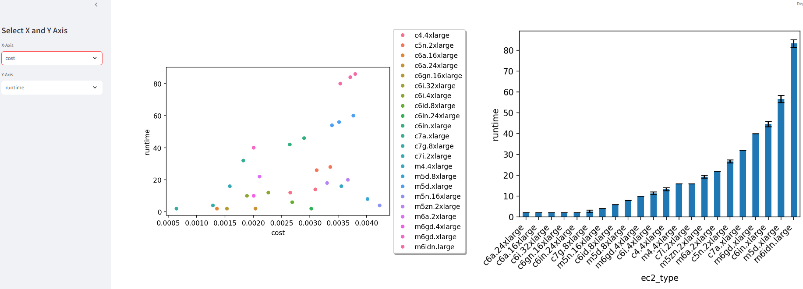
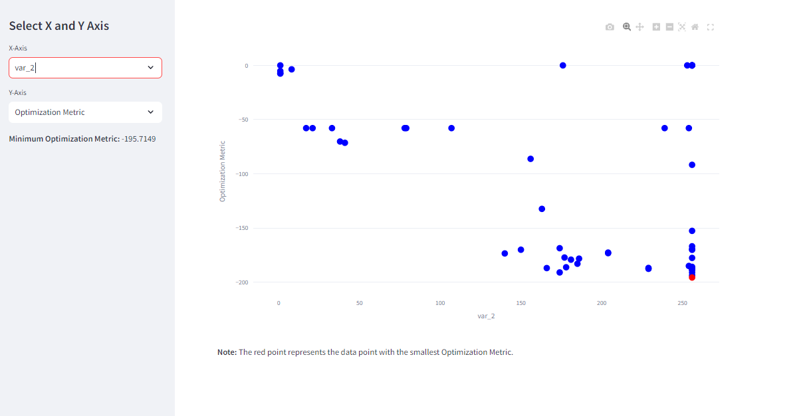

# CloudInstanceOptimizer

## Optimal EC2 Instance and Workload Optimization Tool

This advanced automation tool offers a two-pronged approach to optimize AWS EC2 workloads:
1. Determine the most suitable EC2 instance type for a given workload.
2. Optimize the workload itself to perform optimally on specific EC2 instance types.

This tool is particularly valuable for compute-intensive tasks such as machine learning training, finite element analysis (FEM), computational fluid dynamics (CFD), risk analysis, simulations, and computer graphics rendering.


### How It Works:

1. EC2 Instance Optimization:
   - Users containerize their workload and upload it to Amazon Elastic Container Registry (ECR).
   - They select EC2 instance families to evaluate and specify the number of replicate runs.
   - The tool deploys the workload across selected instance types using AWS Batch.
   - Performance metrics and runtime data are collected for each instance type.
   - A comprehensive report is generated with performance comparisons and cost estimates.

2. Workload Optimization:
   - Users provide their workload and specify target EC2 instance types.
   - The tool analyzes the workload and suggests optimizations such as:
     * Adjusting input parameters for ML models/simulations
     * Modifying ML model usage patterns
     * Enhancing parallelization strategies
     * Optimizing compilation configurations
   - These optimizations are automatically applied and tested across multiple runs.
   - The tool provides a detailed report on performance improvements and trade-offs.

### Value Proposition:

This dual-optimization approach offers unparalleled value to users:

1. EC2 Instance Selection: By automating the process of testing workloads across multiple instance types, it saves countless hours of manual setup and analysis. This data-driven approach can lead to substantial cost savings and performance improvements, especially for large-scale operations.

2. Workload Optimization: The tool's ability to analyze and optimize the workload itself adds another layer of efficiency. By fine-tuning parameters, compilation settings, and execution strategies, users can achieve significant performance gains on their chosen EC2 instances. This is particularly valuable for complex workloads like machine learning, where small optimizations can lead to substantial improvements in speed and cost-efficiency.

3. Comprehensive Analysis: By combining instance selection with workload optimization, users get a holistic view of their performance landscape. This allows for informed decisions that balance instance capabilities with optimized workloads, resulting in the best possible performance-to-cost ratio.

4. Flexibility and Customization: The tool supports optimization of custom metrics beyond just runtime, making it valuable for a wide range of use cases. Whether the goal is to maximize throughput, minimize latency, or optimize for specific hardware accelerators, the tool can be tailored to meet diverse needs.


## Target Users

- Organizations running large-scale EC2 deployments (thousands to millions of instances)
- Teams working on compute-intensive workloads, especially in ML/AI, scientific computing, and data analytics
- Businesses looking to migrate from serverless to EC2 for better performance or cost-effectiveness
- DevOps and infrastructure teams aiming to optimize both their infrastructure choices and application performance


By leveraging this tool, users can achieve a level of optimization that goes beyond simple instance selection, potentially unlocking significant performance improvements and cost savings across their entire EC2 fleet.


### Key Features

- **Flexible Workload Support**: The automation tool supports running virtually any workload by leveraging containers hosted in Amazon Elastic Container Registry (ECR).
- **Customizable Instance Selection**: Users can specify the EC2 instance families they want to evaluate, enabling them to focus on specific CPU or GPU types.
- **Replicate Runs**: To account for variability in runtimes, the tool allows users to specify the number of replicates to run for each instance type.
- **Cost Estimation**: The tool provides cost estimates for each instance type based on the on-demand pricing and expected runtime.
- **Reporting and Visualization**: After completing the runs, the tool generates CSV files and figures to help users compare the performance and cost across different instance types.
- **ML-Based Optimization**: Two optimization methods are included:
	1. Brute-force grid search: Suitable for small parameter spaces.
	2. Bayesian Optimization: Preferable for large parameter spaces and when workload runtimes are long. This method minimizes the number of samples needed to find the optimal configuration.

### Roadmap

Features requested and currently in development:

* Add option for user provided AMI. ECS with AWS Batch requires several startup programs to be installed in the AMI.  Thus, users will need to modify their AMI to run on ECS. 
* Add option to simultaneously optimize hyperparameters and find the best ec2 instance type.


## Getting Started 

To use this automation tool, follow these steps:

1. Install the required dependencies (e.g., AWS CDK, Python). CDK installation instructions can be found [here](https://docs.aws.amazon.com/cdk/v2/guide/getting_started.html).
2. Ensure the AWS CLI is installed and that your EC2 instance has admin permissions for your account. Run ```aws configure```.
3. Clone this repo to your EC2 instance. Then run ```pip install -r requirements.txt``` to install all necessary python packages.
4. Provide a JSON configuration file with the desired EC2 instance families and the number of replicates.  The ```examples``` folder provides json files to review or use.
5. Create your container and push to ECR.  Note the various Dockerfiles in this repo. A user can setup a container however they want, but the automation expects some source files to be available within the container for execution. An example of a container building off of a previous generated container is found in ```Dockerfile-infrn```.  If a user would like to include Graviton EC2 instances, a valid container must be available for both x86 and ARM EC2 types.  For example, ```Dockerfile``` is setup for x86 prime number test, ```Dockerfile-ARM``` is the same container except it is compiled and configured for ARM EC2 instances. See json input in ```./examples/prime_numbers``` for enabling ARM testing.
6. Deploy the necessary infrastructure using the provided CDK deployment. See the example folders. To run the simple prime number tests, navigate to the CDK directory and deploy the infrastructure via the following commands.

    ```
    cd CDKBenchEnv/
    cdk synth -c json_file_path=../examples/prime_numbers/benchmark_config.json
    cdk deploy -c json_file_path=../examples/prime_numbers/benchmark_config.json
    cd ..
    ```

7. Run the automation tool, which will submit containerized workloads to AWS Batch for execution on the specified EC2 instance types. Carefully note in the json file the various options for job execution.

    ```python run_benchmark.py -j ./examples/prime_numbers/benchmark_config.json```
 
	The command ```run_cmd``` will be executed each time the container is activated. The ```monitor_system.py``` will log system activity and save the results to the ```s3_bucket_name``` specified in the json file. The string that comes after ```--cmd``` is the code the user would like executed within the container which can be virtually any executable. 

8. Review the generated visualizations to determine the optimal EC2 instance type for your workload. A streamlit app has been created to make this quick and easy.  The app can be started by running:

	```streamlit run ./streamlitApps/analyze_data_streamlit.py```

	This starts a local server on the EC2 to analyze the data. Use port-forwarding via your local machine ssh piping or a tool such as Visual Studio Code to make this easy.  Navigate to the link printed to screen to examine the data. 



### Hyperparameter Tuning

This code can also be setup to find the optimal set of hyper parameters using either a grid search or ML based bayesian optimization. Examples of using the optimization are in the folders ```./examples/fem_calculation_optimization``` and ```./examples/inferentia_tune```.

The main difference is the inclusion of the optimization keys in the json files. The "optimization_metric" can be any of the system monitor variables such as runtime, RAM usage, etc. or a custom_metric can be used in which the users runscript writes a numerical value to a file named "benchmark_custom.txt". The ML optimizer (selected by default) seeks to minimize the metric.  Thus, if you would like to maximize a value, in the custom metric, write the negative of the value. 

The inputs labeled as "ARGS" will be replaced by the optimizer based on either a grid search or where the ML is exploring the parameter space. 

```
{
	"region_name" : <user account info>,
	"s3_bucket_name" : <user account info>,
	"container_arn" : <user account info>,
	"logGroupName" : "/aws/batch/job",	
	"replications" : 1,
	"review_logs_past_hrs": 1,
	"job_timeout": 40,
	"ec2_types":[ "inf2" ],
	"optimization_iterations": 12,
	"optimization_method": "grid",
	"optimization_parallel_samples": 288,
	"optimization_metric": "custom_metric",
	"optimization_arg1": [1,4],
	"optimization_arg2": [1,9],
	"optimization_arg3": [1,10],
	"optimization_arg1_type": "integer",
	"optimization_arg2_type": "integer",
	"optimization_arg3_type": "integer",
	"run_cmd": "/env_benchmark/bin/python /monitor_system.py -cf /app/vllm/benchmark_custom.txt --cmd /app/vllm/runscript.sh ARGS"
}
```

A streamlit app to review the optimization results can be activated via:

```streamlit run ./streamlitApps/analyze_optimization_streamlit.py```



## Examples

1. **Prime Number calculation:** [Folder](/examples/prime_numbers) EC2 optimization with a very simple application.  Users can start with this example and modify it to quickly apply the tool for their containers. This example demonstrates how to optimize both x86-64 and ARM64 architectures. 
2. **FEM Calculation:** [Folder](/examples/fem_calculation) Similiar to the prime number calculation, but a much more intensive workload.  This includes more complicated containers and runscripts.
3. **FEM Parallelization Optimization:** [Folder](/examples/fem_calculation_optimization) Example of how to find the best parallel configuration for the FEM workload. The runtime is the main objective function for the optimization.
4. **GPU Training Optimization:** [Folder](/examples/gpu_training_optimization) Example of how to find the best learning rate, batch size, and epochs for a GPU ML training workload. The test set loss is the main objective function for the optimization.

### Terminate Tasks

If at any point you would like to terminate all submited jobs in AWS Batch, you can run the command:

```
python run_benchmark.py -k -j ./examples/fem_calculation/benchmark_config.json
```

where we have added the ```-k``` option.

## Contributing

Contributions to this project are welcome. Please follow the contributing guidelines and coding style guidelines when submitting pull requests or reporting issues.

## License

This project is licensed under the [Apache 2.0 License](LICENSE).


